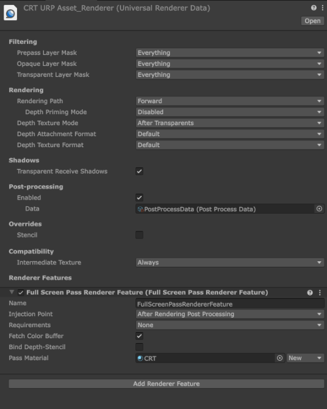
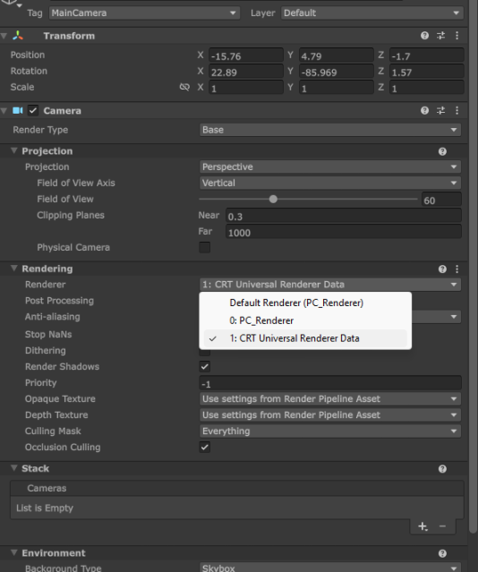

## Set up CRT Shader

Unity 6.3:
Vào Project Settings -> Graphics -> click vào Default Render Pipeline -> Unity sẽ điều hướng tới Universasl Renderer Pipeline Asset project đang sử dụng trong Assets/Settings
Trong foler Assets/Settings: Click chuột phải -> Rendering -> URP Universal Renderer -> một file Universal Renderer Data sẽ được tạo ra; Đặt tên là CRT Universal Renderer Data
Click vào Universasl Renderer Pipeline Asset project đang sử dụng , trong phần Renderer List: click dấu cộng (+), kéo CRT Universal Renderer Data ô trống vừa được tạo
 
Trong phần Inspector của CRT Universal Renderer Data: chọn Add Renderer Feature -> chọn FullScreen Pass Renderer Feature; sau đó sẽ thấy 1 ô Pass Material (lúc sau sẽ kéo CRT Material vào đây) 

Vào Camera và chuyển mục Renderer sang CRT Universal Renderer Data
