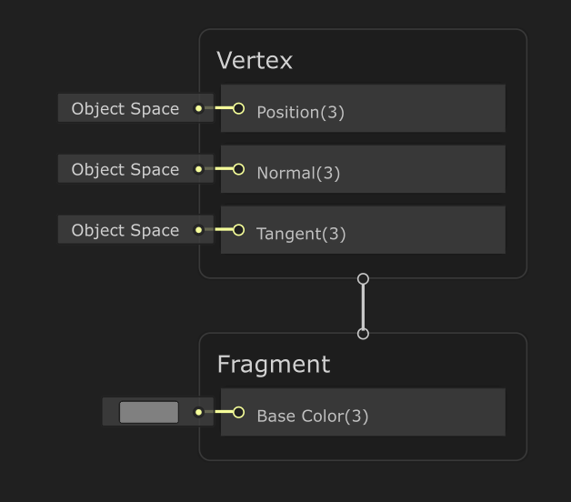
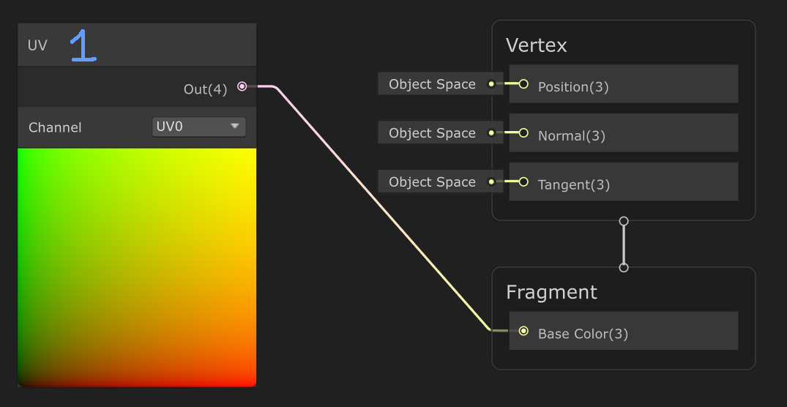
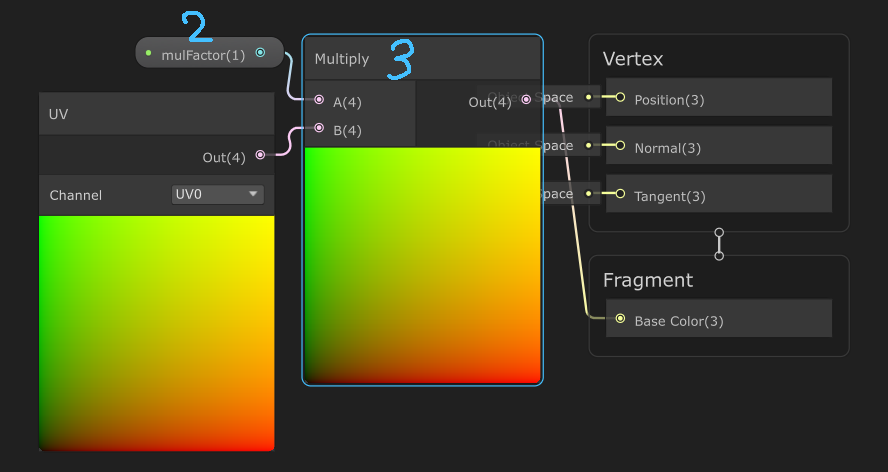
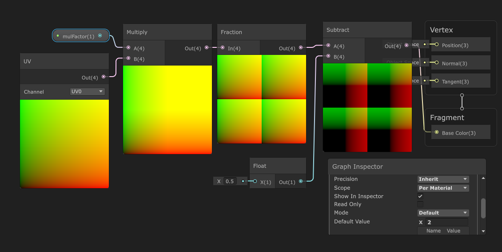

## Giải thích master-node Fragment
   

Khi một chuỗi node được nối vào input Base Color của node Fragment, mỗi fragment (pixel được render) trên bề mặt vật thể sẽ được tính toán màu sắc dựa trên chuỗi node đó - trong đó UV coordinates đóng vai trò là tọa độ tham chiếu để lấy dữ liệu từ texture hoặc thực hiện các phép tính không gian.

Giá trị của BaseColor sẽ được áp dụng cho fragment bằng hệ màu RGB

## Giải thích node UV

1: node UV - Trả về UV coordinate của từng fragment được render 
- Với pixel ở vị trí (0, 0), giá trị trả về là (0, 0)
- Với pixel ở vị trí (1, 1), giá trị trả về là (1, 1)
- ...

- Với pixel ở vị trí (0, 0), giá trị trả về là (0, 0) -> từ giá trị này ta có màu (0, 0, 0, 0) -> red = 0, green = 0, blue = 0, alpha = 0 -> ta thu được **màu đen**
- Với pixel ở vị trí (1, 1), giá trị trả về là (1, 1) -> từ giá trị này ta có màu (1, 1, 0, 0) -> red = 1, green = 1, blue = 0, alpha = 0 -> ta thu được **màu vàng**
- Với pixel ở vị trí (1, 0), giá trị trả về là (1, 0) -> từ giá trị này ta có màu (1, 0, 0, 0) -> red = 1, green = 0, blue = 0, alpha = 0 -> ta thu được **màu đỏ**
- Với pixel ở vị trí (0, 1), giá trị trả về là (0, 1) -> từ giá trị này ta có màu (0, 1, 0, 0) -> red = 0, green = 1, blue = 0, alpha = 0 -> ta thu được **màu xanh lá**
=> Đây cũng chính là 4 màu ở 4 góc của phần preview trên node UV, và cũng sẽ làm 4 màu ở 4 góc của tầm mesh sử dụng shader này 

## Giải thích node Multiply  

2: **float-property mulFactor** - Hệ số nhân  
3: **node Multiply** - Trả về tích của hai giá trị tuyến tính đầu vào  

ở Multiply Node:
- Out = UV * mulFactor
- Out = (u * mulFactor , v * mulFactor)

- Với mulFactor = 1:
  - u * mulFactor = 0 -> 1 (giá trị **u * mulFactor** chạy từ 0 -> 1)  
  - v * mulFactor = 0 -> 1
  - left → right = red gradient
  - bottom → top = green gradient  

- Với mulFactor = 2:
    - u * mulFactor = 0 -> 2
    - v * mulFactor= 0 -> 2
    - Lúc này, hầu hết mesh đều hiện màu vàng (1, 1), chỉ có phần rất nhỏ ở góc thể hiện vùng gradient  

- Với mulFactor = 10:
    - u * mulFactor = 0 -> 10
    - v * mulFactor = 0 -> 10
    - Nhưng screen-color chỉ hiển thị từ 0 -> 1, nên những giá trị > 1 sẽ được ép xuống = 1
    - Lúc này ta sẽ thấy, hầu hết mesh đều hiện màu vàng (1, 1), chỉ có phần nhỏ ở góc gần với (0, 0) là vẫn thể hiện vùng gradient (0, 0) → (1, 1)    

- Với mulFactor = 200:
  - u * mulFactor = 0 -> 200
  - v * mulFactor = 0 -> 200
  - Lúc này, gần như ta sẽ chỉ nhìn thấy một màu vàng trơn  

## Giải thích node Fraction
4: **node Fraction** - Trả về phần thập phân của giá trị đầu vào
- Out = frac(UV * mulFactor)
- Out = (frac(u * mulFactor), frac(v * mulFactor))

- Với mulFactor = 1:
  - u * mulFactor = 0 -> 1 
  - v * mulFactor = 0 -> 1 
  - Ta sẽ thấy hiển thị vẫn giống với **trường hợp mulFactor = 1** khi chưa gắn thêm node Fraction. Vì giá trị UV đã nằm trong khoảng 0 -> 1 => giá trị của u & v bằng đúng phần thập phân (chỉ trừ trường hợp giá trị tại 1)  
  
- Với mulFactor = 2:
  - u * mulFactor = 0 -> 2 
  - v * mulFactor = 0 -> 2
  - Lúc này:
    - Khi u chạy từ 0 -> 0.5 thì frac(u * mulFactor) sẽ chạy từ 0 -> 1. 
    - Nên ta sẽ thấy khi (u chạy từ 0 -> 0.5 và v chạy từ 0 -> 0.5) sẽ tạo thành một hình vuông có màu từ đen đến vàng ((0, 0) -> (1, 1))
    - Tương tự với các cặp:
      - (u chạy từ 0.5 -> 1, v chạy từ 0 -> 0.5) 
      - (u chạy từ 0 -> 0.5, v chạy từ 0.5 -> 1)
      - (u chạy từ 0.5 -> 1, v chạy từ 0.5 -> 1)
    - Như vậy ta sẽ có 4 hình vuông có màu từ đen đến vàng  
    

## Giải thích node Subtract
5: **node Suctract**

## Giải thích node Absolute
6: node Absolute - Trả về giá trị tuyệt đối của đầu vào
- Out = abs(frac(UV * mulFactor))
- Out = (abs(frac(u * mulFactor)), abs(frac(v * mulFactor)))

- Với mulFactor = 2:
  - u * mulFactor = 0 -> 2 
  - v * mulFactor = 0 -> 2
  - Ta sẽ thấy hiển thị vẫn giống với **trường hợp mulFactor = 2** khi chưa gắn thêm node Absolute. Vì giá trị của frac đã nằm trong khoảng 0 -> 1 => giá trị của u & v bằng đúng phần thập phân (chỉ trừ trường hợp giá trị tại 1)  
  