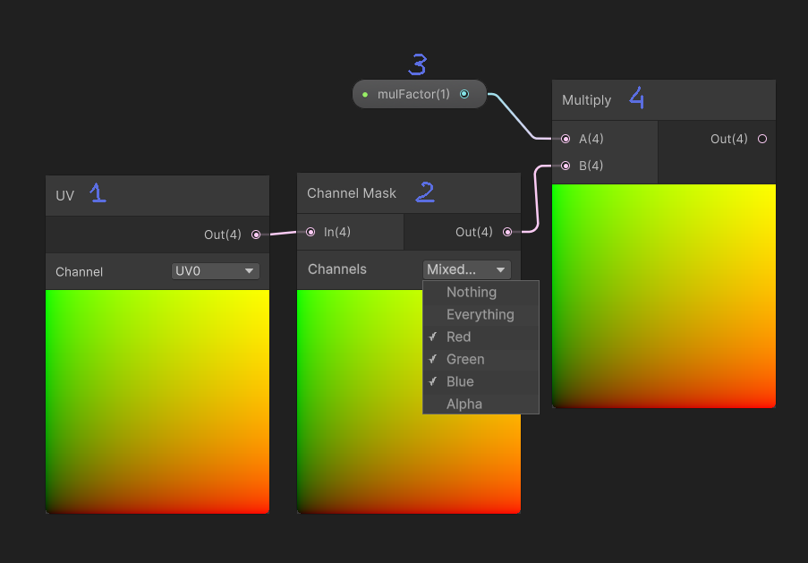
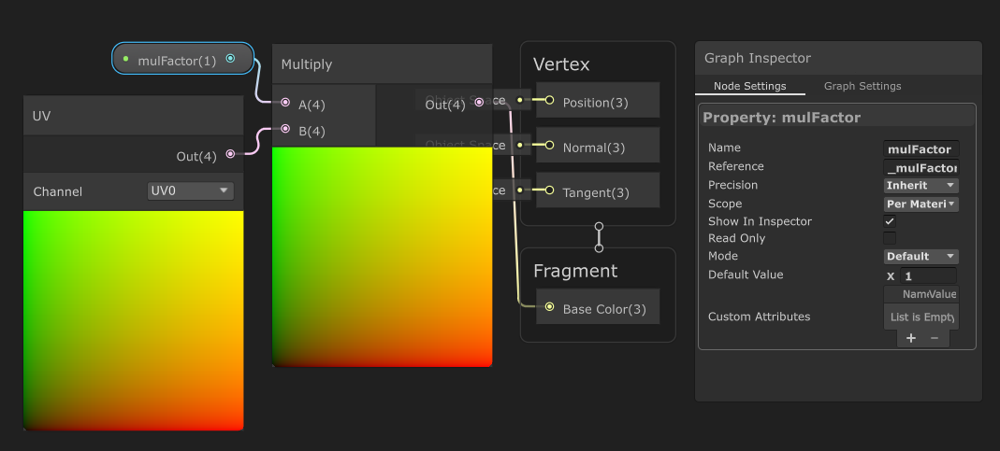
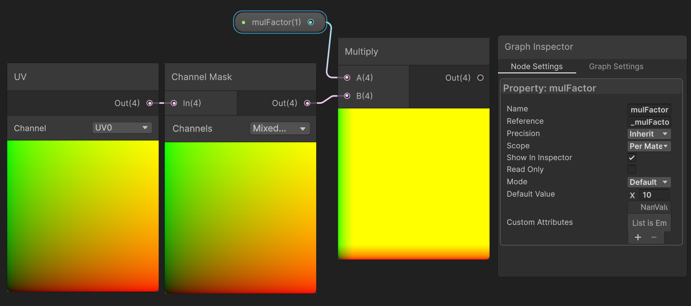
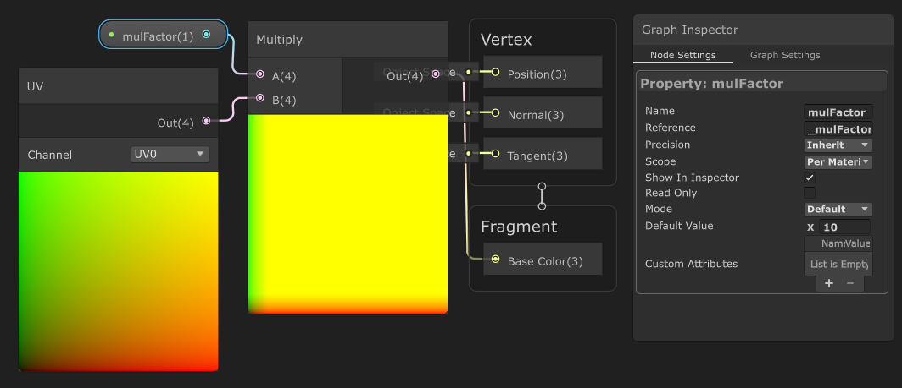
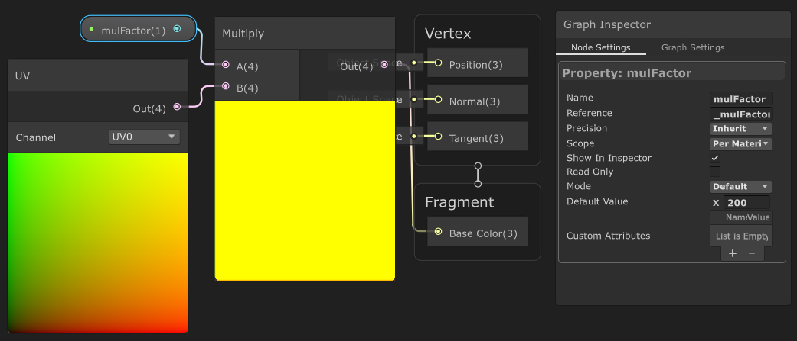
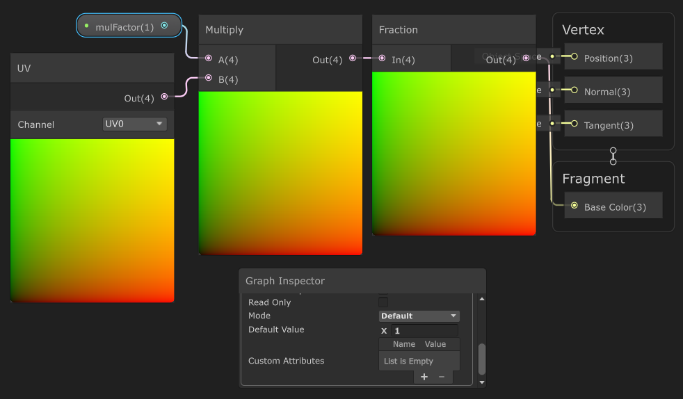
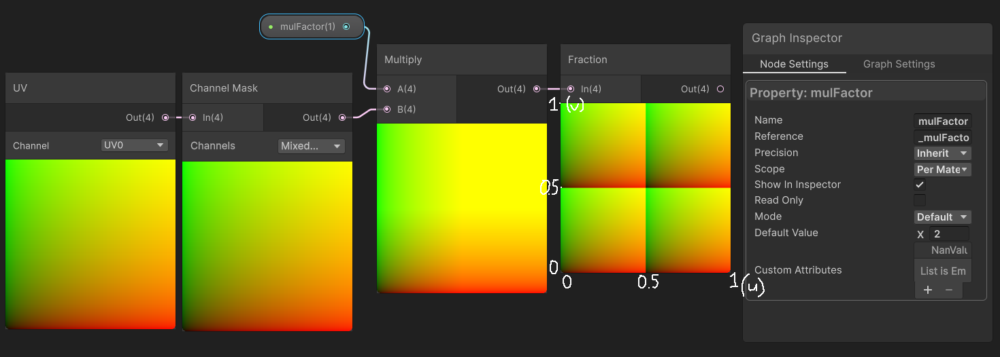
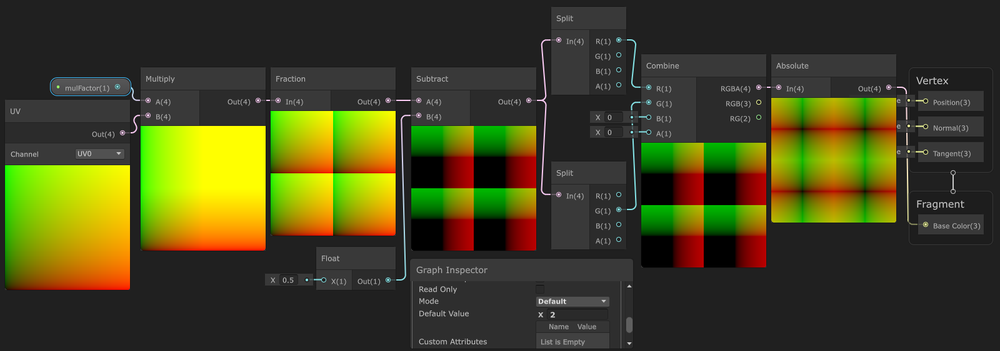

## Giải thích node Multiply  

1: node UV - Trả về UV coordinate của từng pixel trên mesh  
2: node Channel Mask - Lấy một số kênh màu cụ thể (R, G, B, A) từ UV coordinate  
3: float-property mulFactor  
4: node Multiply - Nhân hai giá trị lại với nhau  

ở Multiply Node:
- Out = UV * multiFactor
- Out = (u * multiFactor , v * multiFactor)

- Với multiFactor = 1:
  - u * mulFactor = 0 -> 1 (giá trị **u * multiFactor** chạy từ 0 -> 1)  
  - v * multiFactor = 0 -> 1
  - left → right = red gradient
  - bottom → top = green gradient  
  
- Với multiFactor = 10:
  - u * multiFactor = 0 -> 10 
  - v * multiFactor = 0 -> 10
  - Nhưng screen-color chỉ hiển thị từ 0 -> 1, nên những giá trị > 1 sẽ được ép xuống = 1
  - Lúc này ta sẽ thấy, hầu hết mesh đều hiện màu vàng (1, 1), chỉ có phần nhỏ ở góc gần với (0, 0) là vẫn thể hiện vùng gradient (0, 0) → (1, 1)  
  
- Với multiFactor = 50:
  - u * multiFactor = 0 -> 50
  - v * multiFactor= 0 -> 50
  - Lúc này, hầu hết mesh đều hiện màu vàng (1, 1), chỉ có phần rất nhỏ ở góc thể hiện vùng gradient  
  
- Với multiFactor = 100:
  - u * multiFactor = 0 -> 100
  - v * multiFactor = 0 -> 100
  - Lúc này, gần như ta sẽ chỉ nhìn thấy một màu vàng trơn  
  

## Giải thích node Fraction
5: node Fraction - Trả về phần thập phân của giá trị đầu vào
- Out = frac(UV * multiFactor)
- Out = (frac(u * multiFactor), frac(v * multiFactor))

- Với multiFactor = 1:
  - u * multiFactor = 0 -> 1 
  - v * multiFactor = 0 -> 1 
  - Ta sẽ thấy hiển thị vẫn giống với **trường hợp multiFactor = 1** khi chưa gắn thêm node Fraction. Vì giá trị UV đã nằm trong khoảng 0 -> 1 => giá trị của u & v bằng đúng phần thập phân (chỉ trừ trường hợp giá trị tại 1)  
  
- Với multiFactor = 2:
  - u * multiFactor = 0 -> 2 
  - v * multiFactor = 0 -> 2
  - Lúc này:
    - Khi u chạy từ 0 -> 0.5 thì frac(u * multiFactor) sẽ chạy từ 0 -> 1. 
    - Nên ta sẽ thấy khi (u chạy từ 0 -> 0.5 và v chạy từ 0 -> 0.5) sẽ tạo thành một hình vuông có màu từ đen đến vàng ((0, 0) -> (1, 1))
    - Tương tự với các cặp:
      - (u chạy từ 0.5 -> 1, v chạy từ 0 -> 0.5) 
      - (u chạy từ 0 -> 0.5, v chạy từ 0.5 -> 1)
      - (u chạy từ 0.5 -> 1, v chạy từ 0.5 -> 1)
    - Như vậy ta sẽ có 4 hình vuông có màu từ đen đến vàng  
    

## Giải thích node Absolute
6: node Absolute - Trả về giá trị tuyệt đối của đầu vào
- Out = abs(frac(UV * multiFactor))
- Out = (abs(frac(u * multiFactor)), abs(frac(v * multiFactor)))

- Với multiFactor = 2:
  - u * multiFactor = 0 -> 2 
  - v * multiFactor = 0 -> 2
  - Ta sẽ thấy hiển thị vẫn giống với **trường hợp multiFactor = 2** khi chưa gắn thêm node Absolute. Vì giá trị của frac đã nằm trong khoảng 0 -> 1 => giá trị của u & v bằng đúng phần thập phân (chỉ trừ trường hợp giá trị tại 1)  
  